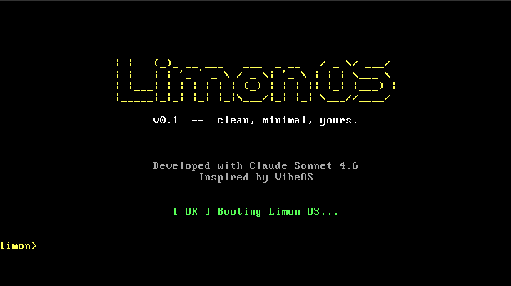
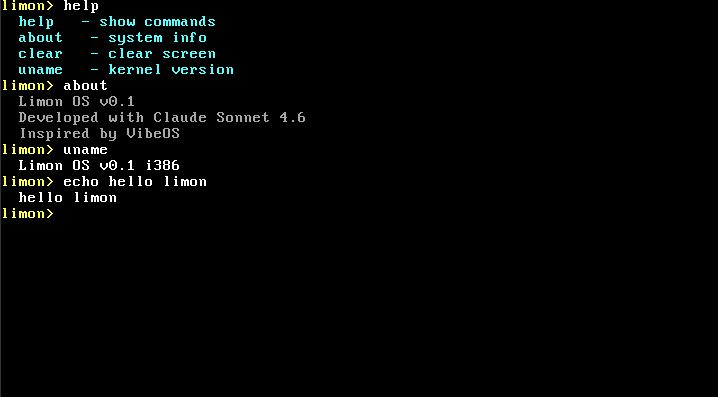

# 🍋 Limon OS

> чисто, минималистично, своё.

Хобби-операционная система написанная с нуля для x86.  
Вдохновлена [VibeOS](https://github.com/kaansenol5/VibeOS). Разработано с Claude Sonnet 4.6.

---

## Скриншоты




---

## Что внутри

- Загрузчик через GRUB (Multiboot)
- VGA драйвер с 16 цветами и скроллингом
- Драйвер клавиатуры PS/2 через аппаратные прерывания (IDT)
- GDT — сегментация памяти
- Интерактивный шелл с командами: `help`, `about`, `uname`, `clear`, `echo`

## Требования

- Debian-based Linux (Ubuntu, Mint, и др.)
- `gcc`, `nasm`, `qemu-system-x86`, `grub-pc-bin`, `xorriso`

## Установка зависимостей
```bash
sudo apt install build-essential gcc nasm qemu-system-x86 grub-pc-bin xorriso
```

## Сборка и запуск
```bash
make        # собрать
make run    # запустить в QEMU
```

---

*Limon OS — чисто, минималистично, своё.* 🍋