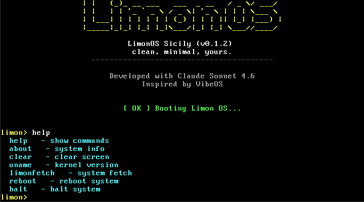
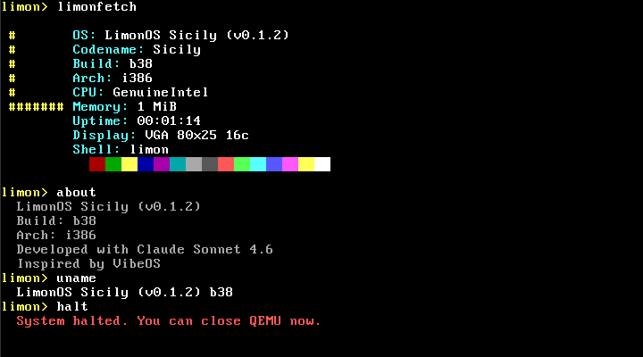

# 🍋 LimonOS Sicily

> чисто, минималистично, своё.

Хобби-операционная система написанная с нуля для x86.  
Вдохновлена [VibeOS](https://github.com/kaansenol5/VibeOS). Разработано с Claude Sonnet 4.6.

**Актуальная версия: Sicily 0.1.2**

**Прототип интерфейса LimonOS Menton: <a href="https://limon.oguzok.tech/" target="_blank">click 🚀</a>**

---

## Скриншоты




---

## Что внутри

- Загрузчик через GRUB (Multiboot)
- VGA драйвер с 16 цветами и скроллингом
- Драйвер клавиатуры PS/2 через аппаратные прерывания (IDT)
- GDT — сегментация памяти
- PIT-таймер (100 Гц) - uptime в `limonfetch`
- Интерактивный шелл с командами: `help`, `about`, `uname`, `clear`, `echo`, `limonfetch`
- `limonfetch` — системная информация с CPU vendor, памятью, uptime и цветовой палитрой

---

## Быстрый старт

### 1. Зависимости
```bash
sudo apt install build-essential gcc nasm qemu-system-x86 grub-pc-bin xorriso
```

### 2. Клонировать и запустить
```bash
git clone https://github.com/oguzokdotdev/limon-os.git
cd limon-os
make        # собрать
make run    # запустить в QEMU
```

---

## Roadmap

<details>
<summary><b>🍋 LimonOS Sicily</b> — v0.x.x</summary>

<br>

<details>
<summary>✅ v0.1.0 — Core</summary>

- VGA text driver
- PS/2 keyboard via IDT
- GDT, IDT
- Interactive shell (`help`, `echo`, `clear`, `about`, `uname`)

</details>

<details>
<summary>✅ v0.1.1 — Versioning & CI/CD</summary>

- Version system with `build.no` and auto-generated `version.h`
- `limonfetch` command
- GitHub Actions CI/CD pipeline

</details>

<details>
<summary>✅ v0.1.2 — System Control</summary>

- `reboot`, `halt` commands
- PIT timer at 100 Hz
- `uptime` in `limonfetch`

</details>

<details>
<summary>⏱️ v0.1.3 — Shell UX</summary>

- `help [n]` по страницам/категориям ✅
- История команд (стрелки ↑↓) ✅
- Парсинг аргументов ✅
- `lscmd`, `ver`
- Shift, верхний регистр, полные спецсимволы ✅

</details>

<details>
<summary>🔲 v0.1.4 — CPU Exceptions</summary>

- Обработчики #DE, #GP, #PF, #DF
- `panic()` — экран с ошибкой и halt

</details>

<details>
<summary>🔲 v0.1.5 — libc Foundation</summary>

- `string.c` — strlen, strcmp, strcpy, strcat
- `memory.c` — memset, memcpy, memmove
- `convert.c` — itoa, atoi

</details>

<details>
<summary>🔲 v0.1.6 — VGA Extended</summary>

- Цвета текста и фона (`color fg bg`)
- Скроллинг экрана
- Аппаратный VGA курсор

</details>

<details>
<summary>🔲 v0.1.7 — Verbose Boot</summary>

- `[  OK  ]` / `[ WARN ]` / `[ FAIL ]` с цветами
- Логирование каждого этапа инициализации

</details>

<details>
<summary>🔲 v0.1.8 — Timers & RTC</summary>

- Чтение реального времени из RTC
- Команда `date`
- Дата в `limonfetch`

</details>

<details>
<summary>🔲 v0.1.9 — Refactoring</summary>

- Единый `kernel.h`
- Структура папок под v0.2.0
- Ревизия CI/CD

</details>

<details>
<summary>🔲 v0.2.0 — Memory</summary>

- Paging
- kmalloc

</details>

<details>
<summary>🔲 v0.3.0 — Processes</summary>

- Процессы
- Планировщик

</details>

<details>
<summary>🔲 v0.4.0 — FAT32</summary>

- Файловая система FAT32

</details>

<details>
<summary>🔲 v0.5.0 — Userspace & Syscalls</summary>

- Userspace
- Syscalls

</details>

</details>

<details>
<summary><b>🍋 LimonOS Menton</b> — v1.x.x</summary>

<details>
<summary>🔲 v1.0.0 — GUI</summary>

- Графический интерфейс

</details>

</details>

---

*Limon OS — чисто, минималистично, своё.* 🍋
