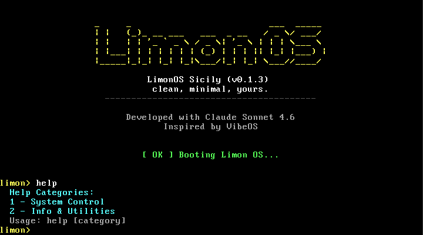
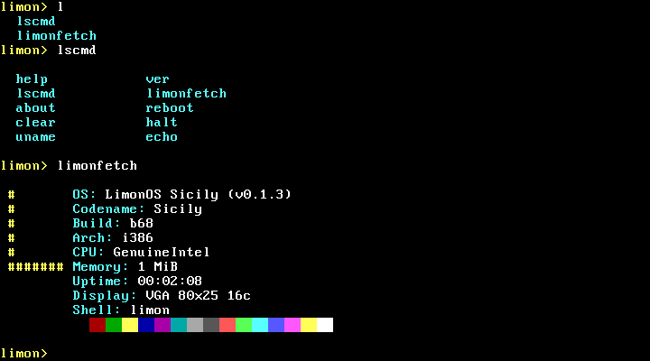

# 🍋 LimonOS Sicily

> чисто, минималистично, своё.

Хобби-операционная система написанная с нуля для x86.  
Вдохновлена [VibeOS](https://github.com/kaansenol5/VibeOS). Разработано с Claude Sonnet 4.6.

**Актуальная версия: Sicily 0.1.9**

**Прототип интерфейса LimonOS Menton: <a href="https://limon.oguzok.tech/" target="_blank">click 🚀</a>**

---

## Скриншоты




---

## Что внутри

- Загрузчик через GRUB (Multiboot)
- VGA драйвер с 16 цветами и скроллингом
- Драйвер клавиатуры PS/2 через аппаратные прерывания (IDT)
- GDT — сегментация памяти
- PIT-таймер (100 Гц) — uptime в `limonfetch`
- Обработчики CPU-исключений (#DE, #GP, #PF, #DF) с экраном паники (`panic()`)
- Интерактивный шелл с командами: `help`, `lscmd`, `about`, `uname`, `ver`, `clear`, `echo`, `limonfetch`, `reboot`, `halt`, `date`
- `help [категория]` — справка по категориям команд (System Control / Info & Utilities)
- `lscmd` — список всех команд в колоночном формате
- `uname` — системная информация с флагами (`-o`, `-v`, `-c`, `-i`, `-b`, `-a`)
- `limonfetch` — системная информация с ASCII-логотипом, CPU model, памятью, uptime и цветовой палитрой
- `reboot` / `halt` — управление питанием через keyboard controller и `cli; hlt`
- `date` — вывод текущей даты и времени
- История команд (16 записей) с навигацией стрелками ↑↓
- Tab-автодополнение команд (одно совпадение — вставка, несколько — список)
- CPUID для определения модели CPU
- Чтение памяти из Multiboot-структуры (`mem_upper`)
- Базовая библиотека ядра `kernel/libc/`: строки (`strlen`, `strcmp`, `strcpy` и др.), память (`memset`, `memcpy`, `memmove`, `memcmp`), конвертация (`atoi`, `itoa`, `itoh`)
- Аппаратный VGA курсор
- Логирование загрузки
- RTC драйвер

---

## Быстрый старт

### 1. Зависимости
```bash
sudo apt install build-essential gcc nasm qemu-system-i386 grub-pc-bin xorriso
```

### 2. Клонировать и запустить
```bash
git clone https://github.com/oguzokdotdev/limon-os.git
cd limon-os
make        # собрать
make run    # запустить в QEMU
```

---

## 📖 Это интересно

- [Roadmap & Changelog](ROADMAP.md)

*Limon OS — чисто, минималистично, своё.* 🍋
